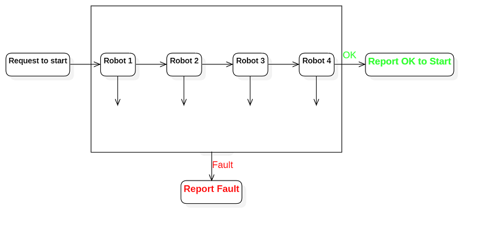
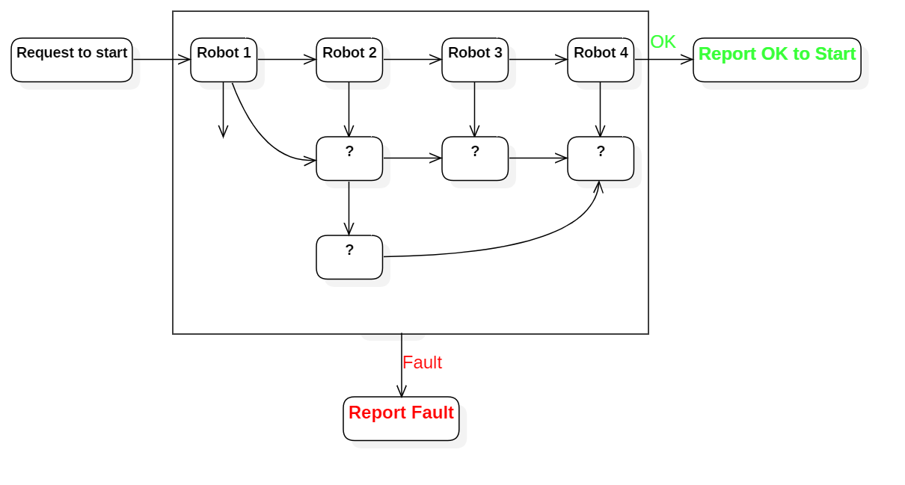
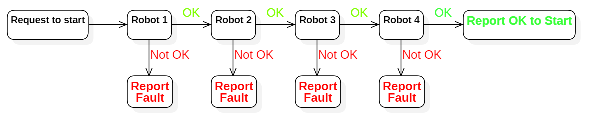
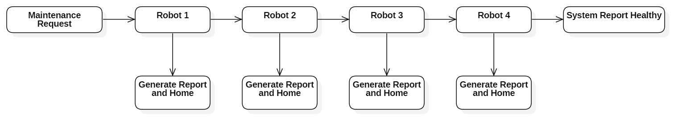
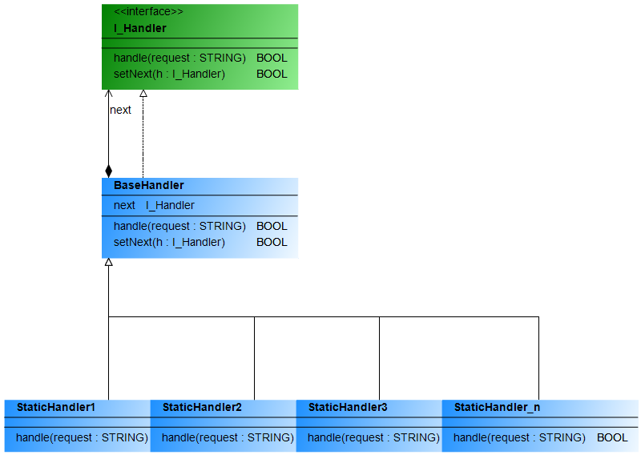

# **Chain of Responsibility**

### **Description**

**Chain of Responsibility** is a behavioral design pattern that lets you pass requests along a chain of handlers objects. Upon receiving a request, each handler object decides whether to process the request or to pass it to the next handler object in the chain.


### **Problem**

Let's pretend that you are working on the latest and greatest robotic assembly line. There are some 6-axis robots, AGVs roaming the floor, and also some overhead crane type bots. You now are required to setup a series of permissive to allow the full line to start running; encoders at home, batteries charged, watchdogs okay. If everything reports back OK, the system will start. However, if any of the checks fail, there is no reason to proceed with checking the other robots.




Over the next year you install more robotic assembly lines, and you implement more of those sequential checks.

- The next customer would like 15 more additional robots in the line, so you add extra check code inside your POU to compensate.

- Later, one of the engineers on your team discovers that there is a safety point that has been missed in the check routine. This is a critical point that needs to be checked before the system can go into run.

- Next, your boss wants to add a feature that allows the system to recover from a power outage, a soft check on the robots is permissible. You can now use data that was previously checked and stored in persistent data, instead of scanning/homing each individual robot.



You can see that the code of checks grows fairly messy over a short period of time. Adding more features might not be possible, or will create a headache and lengthy debug schedules. Changing one check might break another, and worst of all, the code is rendered almost unusable on other systems.

The system becomes very hard to comprehend and maintain. Imagine having to train the whole team on who this complex section of code works, multiple times, and they need to pass on this tribal knowledge for the lifetime of the machine. How do we solve this? with a Chain of Responsibilities!


### **Solution**

As with other behavioral design patterns, the **Chain of Responsibilities** is based on the idea of transforming particular behaviors into stand-alone objects called ***handlers***. In this application, each check could be extracted into its own class with a single check method. The request to start can be passed, along with other relevant data, as an input argument to the check methods.

The pattern is used by linking each handler into a chain. Each linked handler has a reference to the next handler in the chain. Once the handler has processed the request, it will then pass the request on to the next handler in the chain. If for some reason the request to a handler does not meet the requirements, the system can chose to not continue and stop the request process from further processing.


 

Now, imagine using this chain for not only fault checking, like the example above, but also other request based items. With this structure, a handler object isn't limited to only reporting back in the case of a failure. The handler can also choose to process a request if it wants, this can be very advantageous. 

For instance, your boss wants you to create a program to allow the first freely available robot to doc at home, while the system is running, and then allow some technicians to run routine diagnostics. To avoid doing a broadcast message and evaluating the data, lets assume that with a bit of planning you realize that the checks should be performed sequentially. 

A technician should be able to use the HMI to send out a request. The request is passed from each robot until if finds the first available robot to process the request.



Not only is this possible with a **Chain of Responsibilities**, but you can also create a tree type architecture for the handlers to process requests. Imagine not only having a **Generate Report and Home** command, but also a **Beep** command, or a **Lights On**/**Lights Off** command. To access those features, you simply change the request that you send to the handler chain. You are essentially creating a tree of commands, but because the handlers use the same interface they can be used in a chain.


### **Analogy**

You've recently purchase a CANopen servo drive for a new machine application. Upon opening the box, you realize there is no information on where to find the datasheet or EDS file.

- First, you go to the manufacturers website. With no luck in their downloads/support section, you turn up empty handed and find only their phone number for support.
- You call the manufacturers support hotline, you hear the automated system on the other end reading off the various choices. *Press 1 for sales..., Press 2 for service..., Press 3 for support...* Bingo! So you press 3.
- After explaining to the support engineer what you are looking for, they explain that they only have experience with ProfiNet devices, and they cant seem to find the files you need. However, they can provide the ProfiNet drive documentation if you like? Instead of accepting the ProfiNet offer, you request to speak with a specialist or someone who is familiar with CANopen.
- Eventually, you are greeted with the comforting voice of a CANopen specialist who has been long awaiting an application conversation. They send you the download link to your files, and you are happily on your way.


### **Structure**




- **I_Handler** is a common interface that all the **StaticHandlers** will use throughout the program. It usually will contain one method for processing the request, called **handle()** in the above diagram. However, it might also contain a separate method for setting the next handler in the chain. The choice to have this additional method is if you'd rather it be handled in a contractor method **FB_Init** or separately.

- The **FB_BaseHandler** is an optional class where you would put all your boilerplate code that is common to all the handlers in the chain. The main use of this is to check if there is another handler in the chain; if one exists, it can pass to the next, or it can stop if it's the last in the chain.

  ```c++
  IF ADR(next) <> 0 THEN	//Check if there is another handler in the chain
  	next.handle(request);
  END_IF
  ```

- Inside the **FB_StaticHandler** classes, you can add their specific handler code. The handler can then decide whether to process the request, or pass it to the next handler in the chain.

  ```C++
  IF canHandleRequest(request) THEN	//Check to see if the request can be handled
  	//Do something
  ELSE
  	SUPER^.handle(request);
  END_IF
  ```

- To use this, you'll create some client side code in a POU or inside a base Function Block for the machine that's using the chain.

  ```c++
  VAR
      h1				:	FB_StaticHandler1;
      h2				:	FB_StaticHandler2;
      h3				:	FB_StaticHandler3;
      h_n				:	FB_StaticHandler_n;
      request 		:	STRING	:= 'Hello world!';
      xStartProcess	: BOOL;
  END_VAR
  ```

  ```c++
  h1.setNext(h2);
  h2.setNext(h3);
  h3.setNext(h_n);
  
  IF xStartProcess THEN
  	xStartProcess := FALSE;
  	h1.handle(request);
  END_IF
  ```


### **Example**

There are one example in this repository:

- A basic implementation called **BasicCoR**, with a message box that is displayed along the way as the chain handles a request.


### **Application Use Case**

- **Use the Chain of Responsibility pattern when your program is expected to process different kinds of requests in various ways, but the exact types of requests and their sequences are unknown beforehand.**

  The pattern lets you link several handlers into one chain and, upon receiving a request, “ask” each handler whether it can process it. This way all handlers get a chance to process the request.

- **Use the pattern when it’s essential to execute several handlers in a particular order.**

  Since you can link the handlers in the chain in any order, all requests will get through the chain exactly as you planned.

- **Use the CoR pattern when the set of handlers and their order are supposed to change at runtime.**

  If you provide setters for a reference field inside the handler classes, you’ll be able to insert, remove or reorder handlers dynamically.